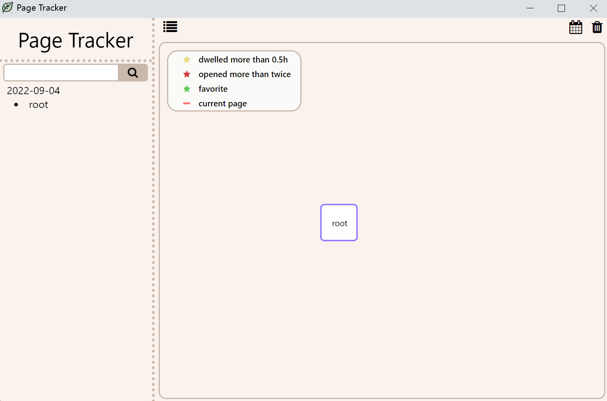
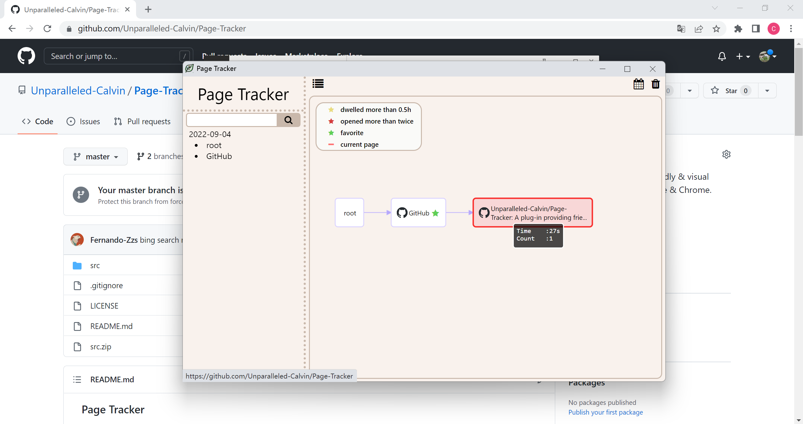
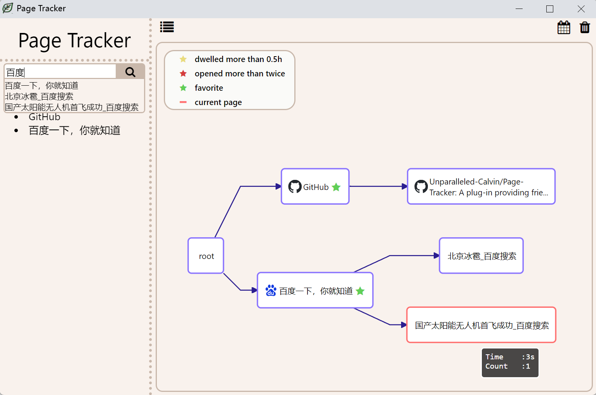
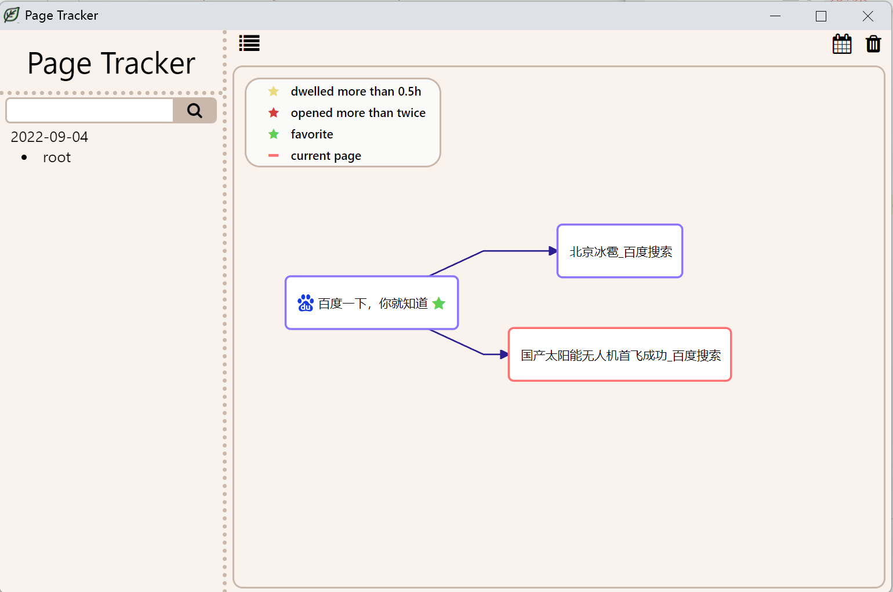
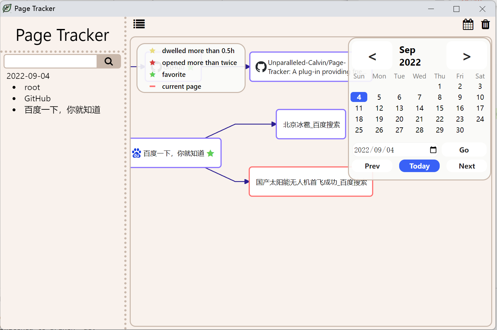
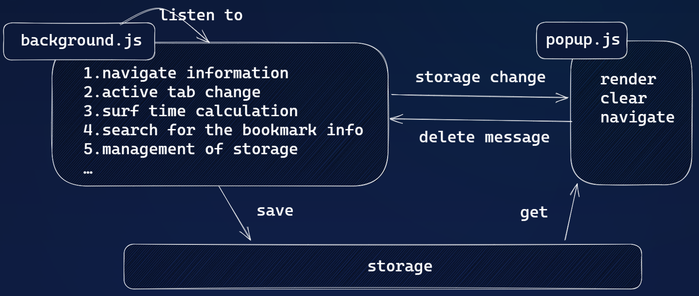

### Page Tracker

A plug-in providing friendly & visual browsing history on Edge & Chrome to help you find important pages.

#### Features

- Record browsing trace in the background and use local storage
- Render beautiful and zoomable graph with clickable nodes
- Mark important pages
- Search pages by specific keywords
- Select any day in history

#### UI

- empty page

  

- current page highlighted

  

- search pages by specific keywords

  

- click an item and show the subgraph

  

- travel to any day you want through the calendar

  

#### Data Flow

#### Authors

South of the Yangtze River in Microsoft Edge Extension Contest 2022

- Developer
  - [Chenhao Cui](https://github.com/Unparalleled-Calvin)
  - [Zesen Zhang](https://github.com/Fernando-Zzs)
- Program Manager
  - Wanwan He
  - Yalan Luo